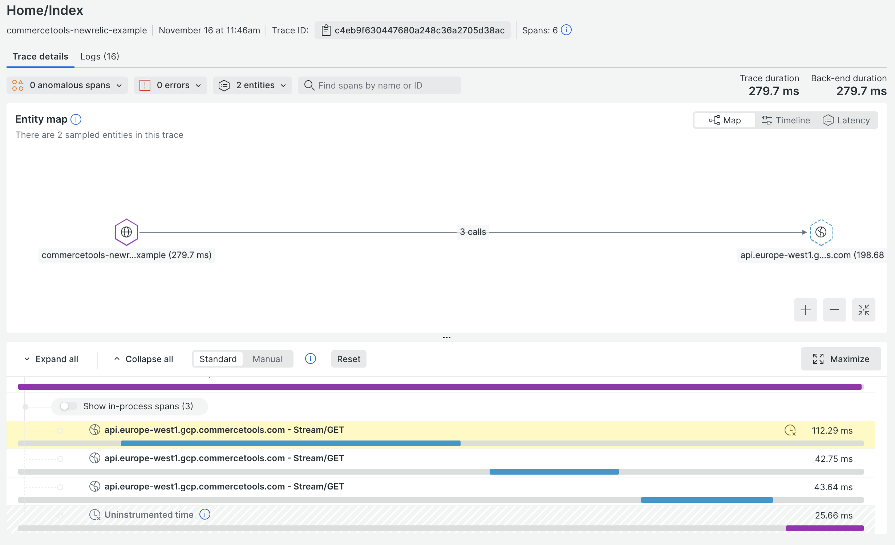

# ME Endpoint Checkout App

This example application demonstrates how the ME endpoints can be used with the DotNET v2 SDK.

## Requirements

- A Composable Commerce Project with a configured [API Client](https://docs.commercetools.com/getting-started/create-api-client#create-an-api-client).
  - Your API Client must have the following scopes: `view_published_products`, `view_categories`, `manage_my_profile`, `manage_my_shopping_lists`, `manage_my_payments`, `manage_my_orders`
- Your Project must have existing Products containing Variants with SKUs, and at least one Customer.
  - If your Project is currently empty, you can install the [SUNRISE sample data](https://github.com/commercetools/commercetools-sunrise-data).

## Installation

1. Clone/Download the Examples folder.
2. Open **\Examples\commercetools.Api.NewRelicExample\appsettings.json** and replace the placeholder values with your API Client credentials.


## Using the ME Endpoint Checkout App

### In Visual Studio

1. Open **\Examples\commercetools.Api.NewRelicExample\commercetools.Api.NewRelicExample.csproj**
2. Select **commercetools.Api.NewRelicExample**


3. Start the app using **Debug** > **Start Debugging** or by pressing **F5**.
4. A new web browser window opens and displays the Checkout app. A list of Products should appear.

### In Visual Studio Code

1. Open the folder **\Examples\commercetools.Api.NewRelicExample**
2. Start the app using **Run** > **Start Debugging** or by pressing **F5**.
3. A new web browser window opens and displays the Checkout app. A list of Products should appear.

## NewRelic

For testing the NewRelic monitoring install the agent according to the [NewRelic docs](https://docs.newrelic.com/install/dotnet/) and
run the example application.

We also provide a [DockerFile](../../../Dockerfile) which installs the agent, compiles the application and runs it.
Execute it by using the following command

```shell
docker run --rm --port 8080:80 --env NEW_RELIC_LICENSE_KEY=<your-license-key>
```

Now locate to http://localhost:8080. You should now be able to see the requests in your NewRelic account

